# MyStore
</a>

# Talent Store App

> This app is a published app of YackeenSolutions where i had an internship
> I was asked to rebuild it as a part of the internship
> I made some changes in the design and code style
> This app is written in kotlin

# Screenshots

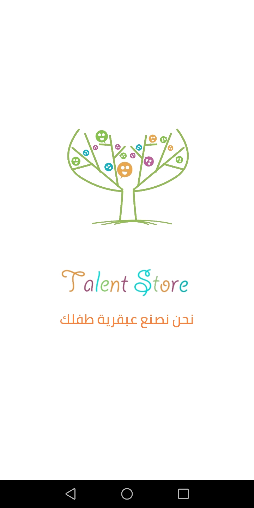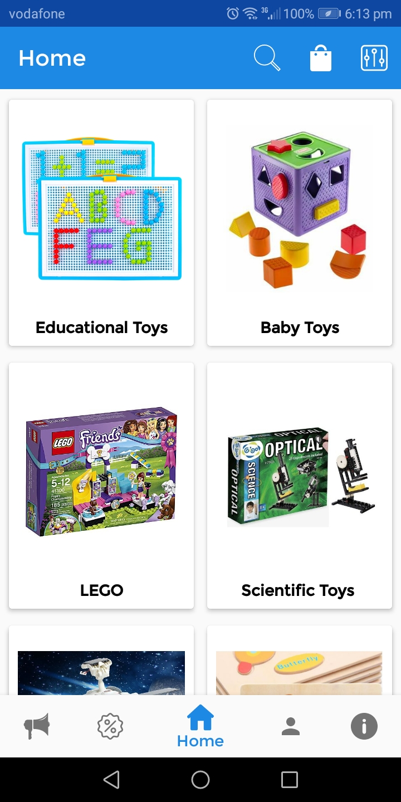
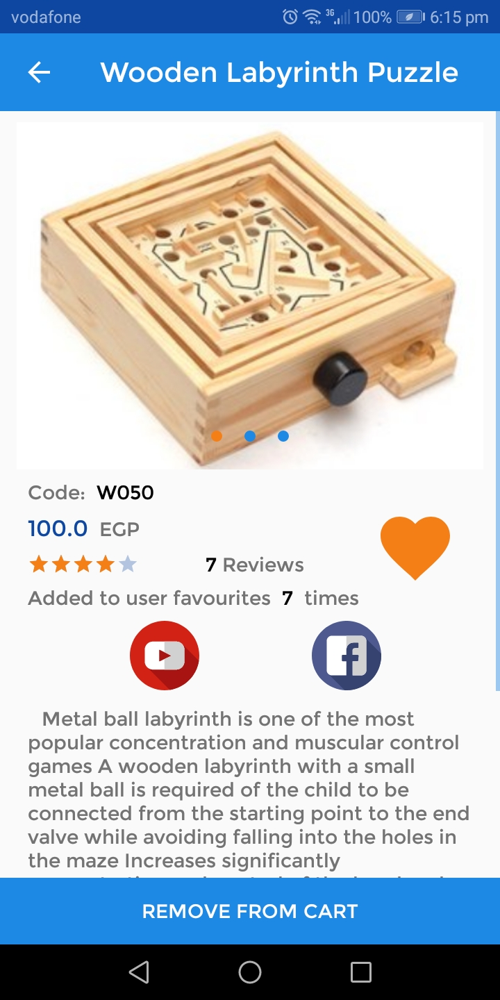
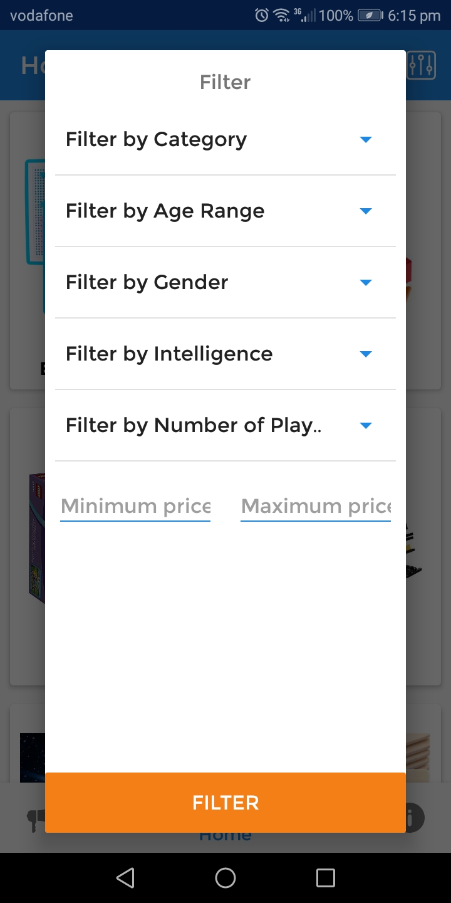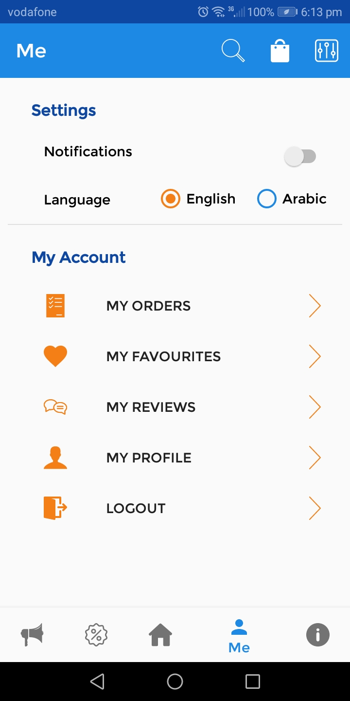
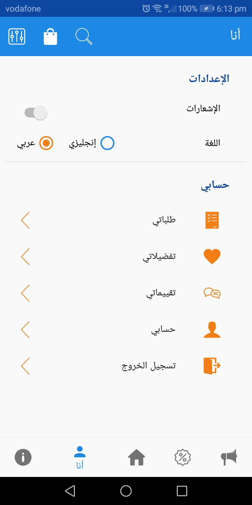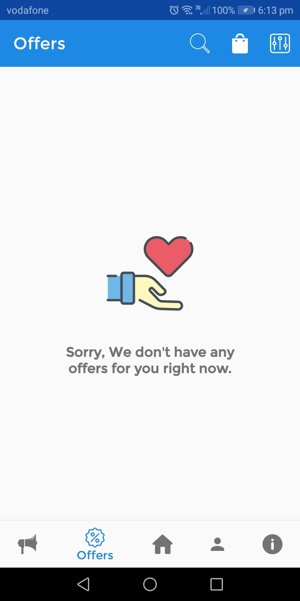
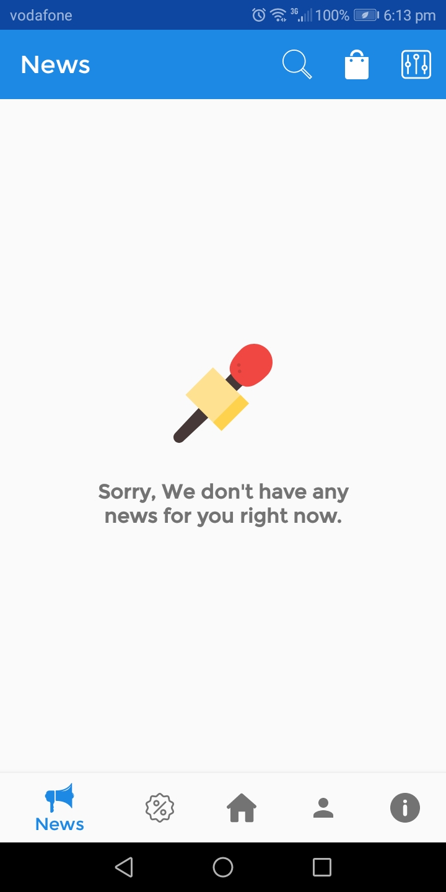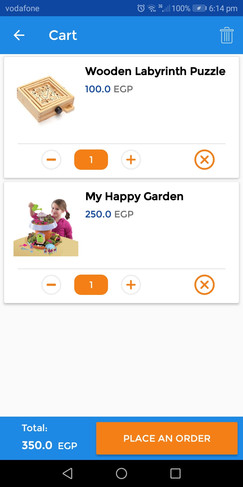
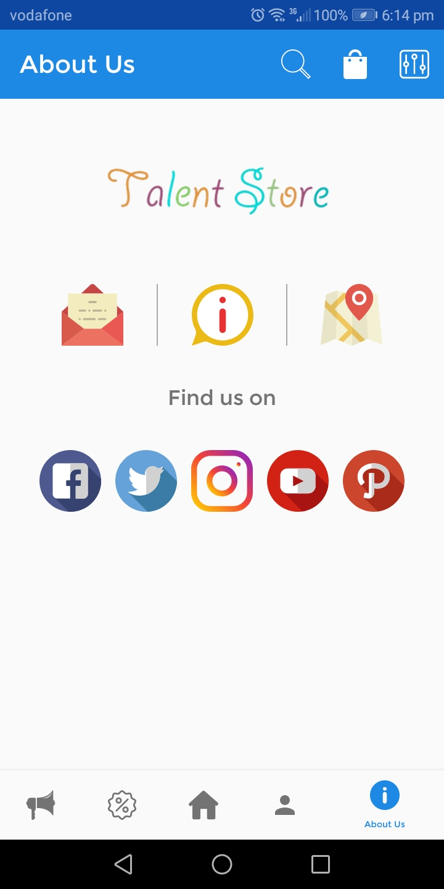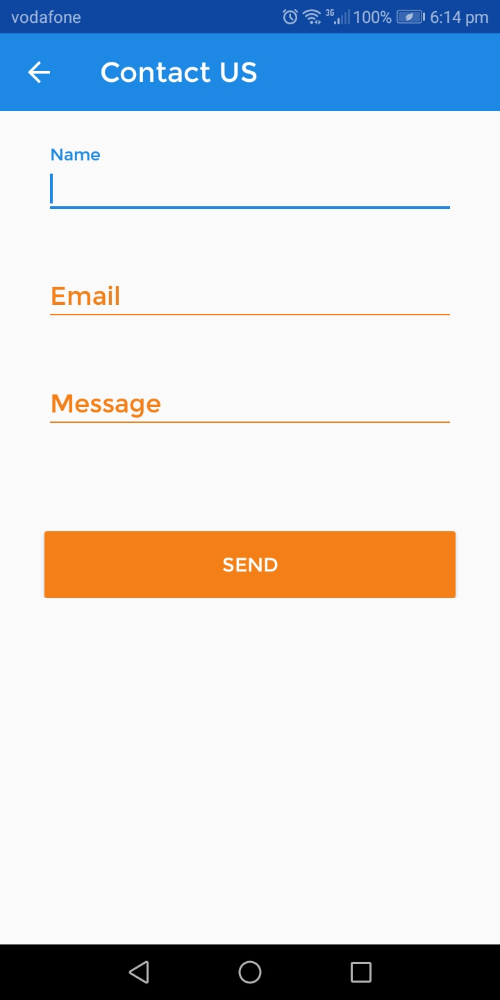
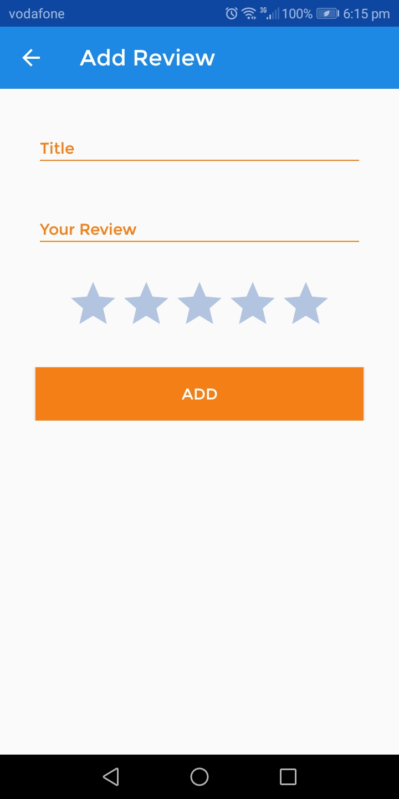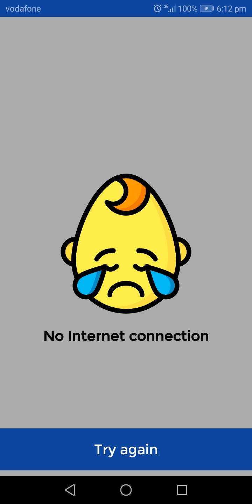

# Liberaries used

- [Kotlin programing language](#kotlin-stdlib-jdk7:1.3.31)
- [Retrofit](#Retrofit 2.5.0)
- [AutoDimension](#AutoDimension:1.0.4)
- [Facebook](#facebook-login:4.41.0)
- [MVVM design pattern](#lifecycle-viewmodel:2.0.0)
- [Glide](#glide:4.9.0)
- [GIF](#android-gif-drawable:1.2.15)
- [Rx-Java](#rxjava:2.1.9)

## Support

- Website at <a href="http://yakensolution.cloudapp.net/" target="_blank">`YackeenSolutions.net`</a>

## Reach out to me at one of the following places!

-- Website at <a href="emish52020@gmail" target="_blank">`myEmail`</a>

