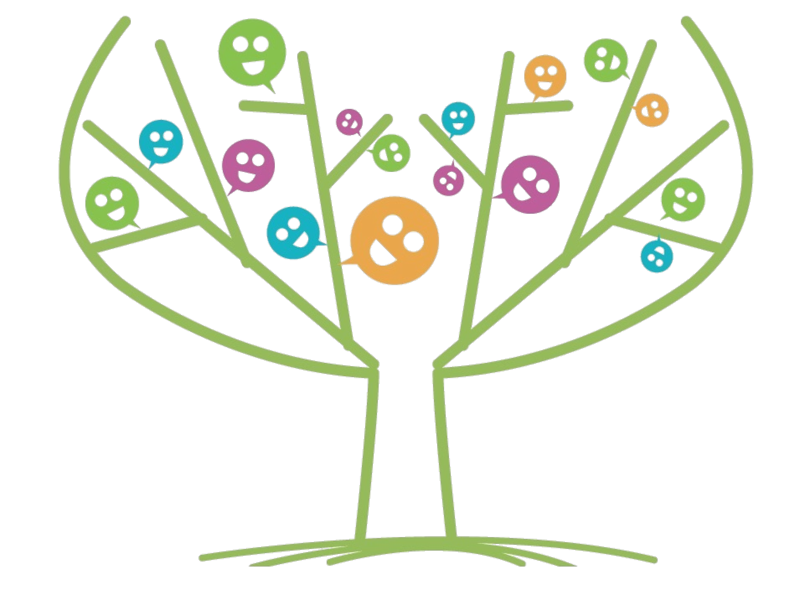
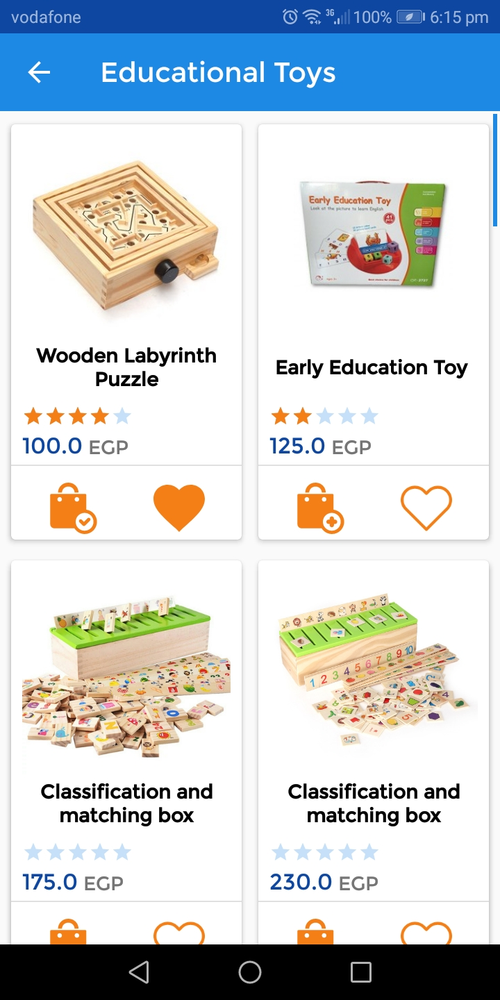

# MyStore
</a>

# Talent Store App

> This app is a published app of YackeenSolutions where i had an internship
> I was asked to rebuild it as a part of the internship
> I made some changes in the design and code style
> This app is written in kotlin

**Badges will go here**

- build status
- issues (waffle.io maybe)
- devDependencies
- npm package
- coverage
- slack
- downloads
- gitter chat
- license
- etc.

[](https://travis-ci.org/badges/badgerbadgerbadger) [](https://gemnasium.com/badges/badgerbadgerbadger) [](https://coveralls.io/r/badges/badgerbadgerbadger) [](https://codeclimate.com/github/badges/badgerbadgerbadger) [](https://github.com/badges/badgerbadgerbadger/issues) [](https://github.com/badges/badgerbadgerbadger/pulls) [](https://rubygems.org/gems/badgerbadgerbadger) [](http://badges.mit-license.org) [](https://github.com/badges/badgerbadgerbadger)

- For more on these wonderful ~~badgers~~ badges, refer to <a href="http://badges.github.io/badgerbadgerbadger/" target="_blank">`badgerbadgerbadger`</a>.

# Screenshots





# Liberaries used


- [Kotlin programing language](#kotlin-stdlib-jdk7:1.3.31)
- [Retrofit](#Retrofit 2.5.0)
- [AutoDimension](#AutoDimension:1.0.4)
- [Facebook](#facebook-login:4.41.0)
- [MVVM design pattern](#lifecycle-viewmodel:2.0.0)
- [Glide](#glide:4.9.0)
- [GIF](#android-gif-drawable:1.2.15)
- [Rx-Java](#rxjava:2.1.9)


---

## Example (Optional)

```javascript
// code away!

let generateProject = project => {
  let code = [];
  for (let js = 0; js < project.length; js++) {
    code.push(js);
  }
};
```

---

## Installation

- All the `code` required to get started
- Images of what it should look like

### Clone

- Clone this repo to your local machine using `https://github.com/fvcproductions/SOMEREPO`

### Setup

- If you want more syntax highlighting, format your code like this:

> update and install this package first

```shell
$ brew update
$ brew install fvcproductions
```

> now install npm and bower packages

```shell
$ npm install
$ bower install
```

- For all the possible languages that support syntax highlithing on GitHub (which is basically all of them), refer <a href="https://github.com/github/linguist/blob/master/lib/linguist/languages.yml" target="_blank">here</a>.

---

## Features
## Usage (Optional)
## Documentation (Optional)
## Tests (Optional)

- Going into more detail on code and technologies used
- I utilized this nifty <a href="https://github.com/adam-p/markdown-here/wiki/Markdown-Cheatsheet" target="_blank">Markdown Cheatsheet</a> for this sample `README`.

---

## Contributing

> To get started...

### Step 1

- **Option 1**
    - 🍴 Fork this repo!

- **Option 2**
    - 👯 Clone this repo to your local machine using `https://github.com/joanaz/HireDot2.git`

### Step 2

- **HACK AWAY!** 🔨🔨🔨

### Step 3

- 🔃 Create a new pull request using <a href="https://github.com/joanaz/HireDot2/compare/" target="_blank">`https://github.com/joanaz/HireDot2/compare/`</a>.

---

## Team

> Or Contributors/People

| <a href="http://fvcproductions.com" target="_blank">**FVCproductions**</a> | <a href="http://fvcproductions.com" target="_blank">**FVCproductions**</a> | <a href="http://fvcproductions.com" target="_blank">**FVCproductions**</a> |
| :---: |:---:| :---:|
| [](http://fvcproductions.com)    | [](http://fvcproductions.com) | [](http://fvcproductions.com)  |
| <a href="http://github.com/fvcproductions" target="_blank">`github.com/fvcproductions`</a> | <a href="http://github.com/fvcproductions" target="_blank">`github.com/fvcproductions`</a> | <a href="http://github.com/fvcproductions" target="_blank">`github.com/fvcproductions`</a> |

- You can just grab their GitHub profile image URL
- You should probably resize their picture using `?s=200` at the end of the image URL.

---

## FAQ

- **How do I do *specifically* so and so?**
    - No problem! Just do this.

---

## Support

Reach out to me at one of the following places!

- Website at <a href="http://fvcproductions.com" target="_blank">`fvcproductions.com`</a>
- Twitter at <a href="http://twitter.com/fvcproductions" target="_blank">`@fvcproductions`</a>
- Insert more social links here.

---
